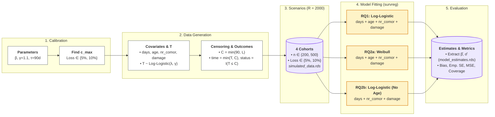

# Survival Analysis Project: Part II

## Report

### Simulation Algorithm

**Task**

Provide a step-by-step description of the simulation procedure.

For example:
(a) Generate covariates.
(b) Generate event times.
(c) Generate censoring times.
(d) Construct the observed dataset.
(e) Fit the proposed model.
(f) Store quantities of interest.
(g) Repeat for many simulation runs.

A flowchart is encouraged.

**Solution**

Our goal is to generate synthetic datasets and then fit parametric models based on observed values which help us answering the following research questions:
**RQ1.** How accurately (bias, variance, MSE) does the log-logistic model estimate the true β ’s, and how does this change with sample size (n = 200 vs. 500) and loss to follow-up (5% vs. 10%)?
**RQ2.** How biased are the estimates if we (a) fit a Weibull model, which cannot capture the early peak, or (b) leave out the confounder age?

The step-by-step procedure of the simulation study is described below and illustrated in Figure 1.

#### Step-by-Step Simulation Procedure

1. **Parameter Calibration & Setup:**
   - **(a) Define True Parameters:** Fix regression coefficients $\boldsymbol{\beta} = (\beta_0 = 5.8, \beta_D = -0.10, \beta_A = -0.02, \beta_K = -0.25, \beta_E = -0.70)$, shape parameter $\gamma = 1.1$, administrative cutoff $\tau = 90$ days, sample sizes $n \in \{200, 500\}$, loss-to-follow-up rates in $\{5\%, 10\%\}$, and Monte Carlo runs $R = 2000$.
   - **(b) Calibrate Censoring Parameter ($c_{\max}$):** For each target loss rate, numerically solve for $c_{\max}$ (`find_cmax` via `uniroot`) so that the expected proportion of loss-to-follow-up events before $\tau$ matches $5\%$ or $10\%$.
2. **Data-Generating Mechanism (per patient):**
   - **(a) Generate Covariates (`generate_data`):**
     - Days to TPE: $D \sim \text{Gamma}(\text{shape} = 2, \text{scale} = 2)$, mean 4 days.
     - Age: $A \sim \mathcal{N}(45, 15^2)$, clamped to $[18, 85]$ years.
     - Number of comorbidities: $K \sim \text{Poisson}(\exp(-2.75 + 0.05 A))$ (confounded by age).
     - Etiology (extrahepatic damage): $E \sim \text{Bernoulli}(\text{logit}^{-1}(-3.9 + 0.06 A))$ (confounded by age).
   - **(b) Generate Latent Event Time (`draw_t`):** Compute median survival $\lambda = \exp(\beta_0 + \beta_D D + \beta_A A + \beta_K K + \beta_E E)$ and sample $T = \lambda (U / (1 - U))^{1/\gamma}$ via inverse transform sampling with $U \sim \text{Uniform}(0, 1)$.
   - **(c) Generate Censoring Times:** Draw random loss-to-follow-up time $L \sim \text{Uniform}(0, c_{\max})$ and define composite right-censoring time $C = \min(\tau, L)$.
   - **(d) Construct Observed Dataset (`generate_cohort`):** Record observed follow-up time $Y = \min(T, C)$ (named `time` in data) and event status indicator $\Delta = I(T \le C)$ (named `status` in data).
   - **(e) Assemble Cohort Across Runs:** Repeat for $n$ patients across $R = 2000$ simulation runs for each of the 4 factorial scenarios ($2 \times 2$), storing the output in `simulated_data.rds`.
3. **Parametric Model Fitting Across Runs (`fit_model_across_runs`):**
   - For each scenario and each run $r \in \{1, \dots, R\}$:
     - **RQ1 (True Log-Logistic Model):** Fit `Surv(time, status) ~ days + age + nr_comor + damage` with `dist = "loglogistic"`. Extract estimated coefficients $\hat{\boldsymbol{\beta}}$ and scale $\hat{\sigma} = 1/\hat{\gamma}$.
     - **RQ2a (Misspecified Hazard - Weibull Model):** Fit `Surv(time, status) ~ days + age + nr_comor + damage` with `dist = "weibull"`. Extract estimated coefficients $\hat{\boldsymbol{\beta}}$ and scale $\hat{\sigma}$.
     - **RQ2b (Omitted Confounder - Log-Logistic Model):** Fit `Surv(time, status) ~ days + nr_comor + damage` (omitting confounder age) with `dist = "loglogistic"`. Extract estimated coefficients $\hat{\boldsymbol{\beta}}$ and scale $\hat{\sigma}$.
4. **Store Quantities of Interest:**
   - Collate all estimates across runs and scenarios into `model_estimates.rds` for subsequent performance evaluation (bias, variance/SE, MSE, and 95% confidence interval coverage).

<!-- Flowchart specification notes:
Two major phases with smaller sub-steps:
- 1. Data Generation:
  - 1.1 Define constants based on plausible values (beta: b0=5.8, bd=-0.1, ba=-0.02, bk=-0.25, be=-0.7; gamma=1.1; tau=90; n in {200, 500}; loss in {0.05, 0.10}; R=2000)
  - 1.2 Define covariate generation function f_{covariates} (generate_data) producing patient covariates (days, age, nr_comor, damage) drawn from specified distributions
  - 1.3 Define survival time generation algorithm f_{survival} (draw_t) that produces latent survival times T via inverse transform sampling conditioned on covariates
  - 1.4 Define censoring calibration function f_{censor_calib} (find_cmax) that numerically solves for c_max to meet target loss-to-follow-up rates under cutoff tau=90
  - 1.5 Define cohort generation function f_{cohort} (generate_cohort) pipelining covariate generation, event times, censoring times C = min(tau, L), observed time Y = min(T, C), and status Delta = I(T <= C)
  - 1.6 Run f_{cohort} across all 4 scenarios to produce and save simulated cohort datasets (simulated_data.rds)
- 2. Model Fitting:
  - 2.1 Define model fitting helper function f_{model} (fit_model_across_runs) that fits parametric AFT models via survreg for each run and extracts estimated coefficients and scale parameter
  - 2.2 Load simulated data from Step 1 (simulated_data.rds)
  - 2.3 Produce estimates for RQ1: Run f_{model} with full covariates (days, age, nr_comor, damage) and log-logistic distribution
  - 2.4 Produce estimates for RQ2a: Run f_{model} with full covariates and Weibull distribution (misspecified hazard)
  - 2.5 Produce estimates for RQ2b: Run f_{model} omitting the confounder age (days, nr_comor, damage) and log-logistic distribution
  - 2.6 Gather and save estimation results to model_estimates.rds for performance metric evaluation
-->



*Figure 1: Simulation study workflow for data generation, censoring calibration, scenario assembly, model fitting, and performance evaluation.*

### Software Implementation

The simulation study is implemented in R across two modular scripts:
1. `src/assignment_part_2/hw2_simulation.R`: Defines the data-generating mechanism, calibrates loss-to-follow-up censoring parameters ($c_{\max}$), generates the $2 \times 2 = 4$ scenario cohorts across $R = 2000$ runs, and saves the data.
2. `src/assignment_part_2/hw2_model_fitting.R`: Reads the simulated cohorts, fits the parametric survival models (`survreg` from `survival`) for RQ1, RQ2a, and RQ2b across all runs, and saves the extracted coefficient and scale estimates.

#### Data Generation and Censoring Script (`hw2_simulation.R`)

```R
set.seed(123)

beta_values <- c(b_0 = 5.8, b_d = -0.1, b_a = -0.02, b_k = -0.25, b_e = -0.7)
gamma_val <- 1.1
phi_vals <- c(p_d = 0.9, p_a = 0.98, p_k = 0.78, p_e = 0.5)
tau <- 90 # days limit

# simulation params
n_1 <- 200
n_2 <- 500
sim_runs <- 2000
loss_follow_up_1 <- 0.05
loss_follow_up_2 <- 0.1
loss_to_follow_up_vector <- c(loss_follow_up_1, loss_follow_up_2)

# generation
generate_data <- function(entries) {
  d <- rgamma(entries, shape = 2, scale = 2)
  a <- pmin(pmax(rnorm(entries, 45, 15), 18), 85)
  k <- rpois(entries, exp(-2.75 + 0.05 * a))
  e <- rbinom(entries, 1, plogis(-3.9 + 0.06 * a))
  data.frame(days = d, age = a, nr_comor = k, damage = e)
}

draw_t <- function(covariates, beta_values, gamma_val) {
  lambda <- exp(
    beta_values["b_0"] +
      beta_values["b_d"] * covariates[["days"]] +
      beta_values["b_a"] * covariates[["age"]] +
      beta_values["b_k"] * covariates[["nr_comor"]] +
      beta_values["b_e"] * covariates[["damage"]]
  )
  u <- runif(nrow(covariates))
  lambda * (u / (1 - u))^(1 / gamma_val)
}

# generate censoring
# type i: patients that are alive past 90 days are censored (value >= 90)
# type ii: loss to follow-up (< cmax)
find_cmax <- function(target_loss, n_count, cutoff, gamma_val, beta_values) {
  # Around 1 million entries for the simulation for cmax
  cmax_sim_data <- generate_data(n_count)
  cmax_sim_times <- draw_t(cmax_sim_data, beta_values, gamma_val)
  # Smallest values between event time and cutoff (remove past cutoff)
  min_times <- pmin(cmax_sim_times, cutoff)
  loss_objective <- function(proposed_cmax) {
    mean(pmin(min_times, proposed_cmax) / proposed_cmax) - target_loss
  }
  uniroot(loss_objective, interval = c(5, max(cmax_sim_times)), tol = 0.5)$root
}

cmax_data <- lapply(
  loss_to_follow_up_vector,
  find_cmax,
  n_count = n_1 * n_2 * 10,
  cutoff = tau,
  gamma_val = gamma_val,
  beta_values = beta_values
)
names(cmax_data) <- loss_to_follow_up_vector

# generate full simulation dataset for a scenario
generate_cohort <- function(n_patients, r_runs, cmax, cutoff,
                            beta_vals, gam_val) {
  total_obs <- n_patients * r_runs
  covariates <- generate_data(total_obs)
  event_times <- draw_t(covariates, beta_vals, gam_val)
  loss_times <- runif(total_obs, min = 0, max = cmax)
  censor_times <- pmin(cutoff, loss_times)
  observed_times <- pmin(event_times, censor_times)
  event_status <- as.integer(event_times <= censor_times)

  data.frame(
    run_id = rep(seq_len(r_runs), each = n_patients),
    days = covariates[["days"]],
    age = covariates[["age"]],
    nr_comor = covariates[["nr_comor"]],
    damage = covariates[["damage"]],
    time = observed_times,
    status = event_status
  )
}

simulated_data <- list(
  n200_loss05 = generate_cohort(
    n_1, sim_runs, cmax_data[["0.05"]], tau, beta_values, gamma_val
  ),
  n200_loss10 = generate_cohort(
    n_1, sim_runs, cmax_data[["0.1"]], tau, beta_values, gamma_val
  ),
  n500_loss05 = generate_cohort(
    n_2, sim_runs, cmax_data[["0.05"]], tau, beta_values, gamma_val
  ),
  n500_loss10 = generate_cohort(
    n_2, sim_runs, cmax_data[["0.1"]], tau, beta_values, gamma_val
  )
)

data_dir <- if (dir.exists("src/assignment_part_2/data")) {
  "src/assignment_part_2/data"
} else {
  "data"
}
if (!dir.exists(data_dir)) {
  dir.create(data_dir, recursive = TRUE)
}

saveRDS(cmax_data, file = file.path(data_dir, "cmax_data.rds"))
saveRDS(simulated_data, file = file.path(data_dir, "simulated_data.rds"))
```

#### Model Fitting Script (`hw2_model_fitting.R`)

```R
library(survival)

# Step 1: Load Simulated Data
# The dataset contains 4 simulation scenarios:
# - Two sample sizes: n = 200 and n = 500 patients
# - Two loss-to-follow-up rates: 5% and 10%
# - Each scenario consists of R = 2000 independent simulation runs
# - Each patient observation has 6 variables:
#   days, age, comorbidities, etiology, observed time, and event indicator
data_dir <- if (dir.exists("src/assignment_part_2/data")) {
  "src/assignment_part_2/data"
} else {
  "data"
}
sim_data_path <- file.path(data_dir, "simulated_data.rds")
simulated_data <- readRDS(sim_data_path)

# Helper function to fit a parametric model across all 2000 runs in a scenario
fit_model_across_runs <- function(scenario_df, model_formula, dist_name) {
  runs <- split(scenario_df, scenario_df[["run_id"]])
  estimates_list <- lapply(runs, function(run_data) {
    fit <- survreg(model_formula, data = run_data, dist = dist_name)
    c(coef(fit), scale = fit[["scale"]])
  })
  estimates_df <- as.data.frame(do.call(rbind, estimates_list))
  names(estimates_df)[names(estimates_df) == "(Intercept)"] <- "intercept"
  estimates_df
}

formula_full <- Surv(time, status) ~ days + age + nr_comor + damage
formula_no_age <- Surv(time, status) ~ days + nr_comor + damage

# Step 2: Fit Models for Research Question 1 (True Log-Logistic Model)
# Objective: Fit the correctly specified model across all 4 scenarios.
# For each of the 4 scenarios:
#   For each simulation run (1 to 2000):
#     Fit the log-logistic survival model using all covariates:
#       response: observed time and event indicator
#       predictors: days to treatment, age, comorbidities, and etiology
#     Extract and store the estimated regression coefficients
#     and shape parameter for this run
rq1_estimates <- lapply(
  simulated_data,
  fit_model_across_runs,
  model_formula = formula_full,
  dist_name = "loglogistic"
)

# Step 3: Fit Models for Research Question 2 (Misspecified Models)
# Objective: Fit alternative models to evaluate misspecification.

# Part A: Misspecified Baseline Hazard (Weibull Model)
#   For each simulation run:
#     Fit a Weibull survival model using all covariates:
#       response: observed time and event indicator
#       predictors: days to treatment, age, comorbidities, and etiology
#     Extract and store the estimated regression coefficients
rq2a_estimates <- lapply(
  simulated_data,
  fit_model_across_runs,
  model_formula = formula_full,
  dist_name = "weibull"
)

# Part B: Omitted Confounder (Leave Out Age)
#   For each simulation run:
#     Fit a log-logistic survival model omitting age:
#       response: observed time and event indicator
#       predictors: days to treatment, comorbidities, and etiology
#     Extract and store the estimated regression coefficients
rq2b_estimates <- lapply(
  simulated_data,
  fit_model_across_runs,
  model_formula = formula_no_age,
  dist_name = "loglogistic"
)

# Step 4: Save Simulation Results
# Save all extracted estimates across runs and scenarios to disk
model_estimates <- list(
  rq1_loglogistic = rq1_estimates,
  rq2a_weibull = rq2a_estimates,
  rq2b_no_age = rq2b_estimates
)

saveRDS(model_estimates, file = file.path(data_dir, "model_estimates.rds"))
```

### Performance Measures

We evaluate the estimates of β_D, β_E, β_A and β_K, with β_E as the main target. In each of the R = 2000 runs we store the estimate β̂ and its standard error. With β̄ the average estimate over all runs, we compute:

Bias = β̄ − β: is the estimate systematically wrong?
Empirical SE = the standard deviation of the estimates: how much does the estimate vary between runs? (Variance = SE².)
MSE = the average of (β̂ − β)² ≈ Bias² + Variance: the total error.
Coverage = the share of 95% confidence intervals that contain the true β: are the standard errors reliable? It should be close to 95%.

For each scenario we also report the observed censoring rate and the number of runs that failed to converge (these are excluded).

Both the log-logistic and the Weibull fits are AFT models fitted with survreg, so their coefficients are on the same scale and can be compared with the same true values. When age is left out, only β_D, β_E and β_K are evaluated.


### Hypotheses

> **Research questions:**
> RQ1. How accurately (bias, variance, MSE) does the log-logistic model estimate the true β ’s, and how does this change with sample size (n = 200 vs. 500) and loss to follow-up (5% vs. 10%)?
> RQ2. How biased are the estimates if we (a) fit a Weibull model, which cannot capture the early peak, or (b) leave out the confounder age?

#### RQ1: Correct log-logistic model

**H1 (bias).** When we fit the correct log-logistic model, the estimated effects will be very close to the true values in all four scenarios. Any small bias at n = 200 will become even smaller at n = 500. The reason is that the fitted model is the same as the model that generated the data, and the censoring does not depend on the survival time, so the estimates are correct on average.

**H2 (sample size).** The estimates will vary less from run to run with 500 patients than with 200. We expect the empirical standard error to drop by about one third, and the MSE to fall to roughly 40% of its value at n = 200. The reason is that more patients give more information. Since the bias is close to zero, the MSE is almost entirely caused by variance and falls with it.

**H3 (loss to follow-up).** Increasing loss to follow-up from 5% to 10% will make the estimates slightly less precise, but will not make them biased. This effect will be much smaller than the effect of sample size. The reason is that extra random censoring only removes some observed events. It does not push the estimates in a particular direction. Many patients are already censored at the 90-day cutoff, so losing an extra 5% makes little difference.

#### RQ2a: Wrong model (Weibull instead of log-logistic)

**H4.** The Weibull model will clearly misestimate the intercept and the shape of the survival curve. The covariate effects (days to treatment, age, comorbidities, etiology) will be only slightly biased. The reason is that the two models differ only in the assumed shape of the survival distribution. Most of the misfit is absorbed by the intercept and shape. The Weibull hazard can only go up or down over time, so it cannot reproduce the early peak in risk. Because many patients are censored, the covariate effects will still be somewhat affected.

**H5.** The bias of the Weibull model will not go away with more patients, while its variance will. This means that the Weibull model will look relatively worse at n = 500 than at n = 200, compared with the correct model. The reason is that a wrong model is precisely estimating the wrong thing: more data makes the estimate more stable but not more accurate.

**H6.** The Weibull model will be somewhat more biased at 10% loss to follow-up than at 5%. The reason is that the more of the data is censored, the more the estimates depend on the assumed shape of the distribution, which is wrong here.

#### RQ2b: Leaving out the confounder age

**H7.** Leaving age out of the model will make comorbidities and damage outside the liver look more harmful than they really are. The reason is that in our data, older patients have more comorbidities and more often have damage outside the liver, and older patients also survive shorter. Without age in the model, part of the harmful effect of age is wrongly attributed to comorbidities and etiology.

**H8.** The effect of days to treatment will stay close to its true value when age is left out, but it will be estimated slightly less precisely. The reason is that days to treatment was generated independently of age, so age does not confound it. The variation in survival caused by age becomes unexplained noise. This makes the estimates a bit less precise, but does not push them in a particular direction.

## Appendix

### Response to Feedback

> "The only comment I have is that you do not look up the literature after Gemini gave you information about TPE and liver failure. Can you check this for the next assignment?"

**Response:** As a fact-checking the provided information from Geimini Pro, based on ([https://www.aasld.org/liver-fellow-network/core-series/why-series/why-would-we-consider-plasma-exchange-acute-liver](https://pmc.ncbi.nlm.nih.gov/articles/PMC9239959/#Sec12)), TPE is used for AFL for either as a "bridge" to liver recovery or maintain stability until liver transplant is possible. When it comes to comorbitidies, older age is strongly associated with an increased accumulation and severity of extrahepatic comorbid diseases (such as cardiovascular disease, chronic kidney disease, and type 2 diabetes) [Jepsen, 2014, pp. 7223–7225]. Metabolic comorbidities (obesity, type 2 diabetes, dyslipidemia) are the primary drivers of metabolic problems associated with steatotic liver disease [Huang et al., 2023, pp. 389–391]. Patients receiving TPE for acute liver failure are critically ill intensive-care patients and their trajectory is determined within days to weeks by either native hepatocyte recovery or emergency transplant, making outpatient hospital readmission an uninformative metric for acute TPE efficacy [Chris-Olaiya et al., 2021, pp. 905–906]. Reviewing this literature justified moving away from a hospital readmission framework and instead defining the failure event in Part I as transplant-free survival (time to death or liver transplant), observed from the first TPE cycle with right-censoring at 90 days [Larsen et al., 2016, pp. 70–72; Chris-Olaiya et al., 2021, p. 906].

### Use of Artificial Intelligence Tools

### Contribution Statement

### Rubric (not part of the submission)

- Feedback: 5
- Code: 1
- Correct implementation: 1
- Presentation of results: 1
- Interpretation and discussion: 1
- Conclusions and recommendations: 1
